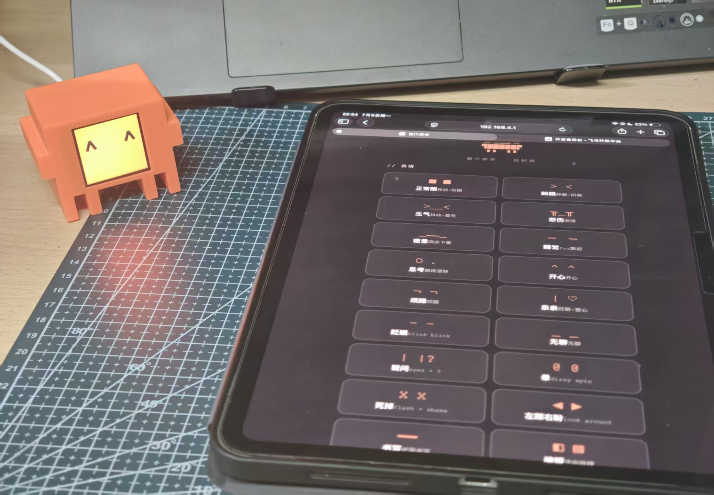

# 🦀 cc_mochi_szw

> ESP32-C3 桌面宠物 · 26 种动态表情 · Claude Code 实时联动



## 项目概述

**cc_mochi_szw** 是一个基于 ESP32-C3 微控制器的桌面伴侣设备。它在一块 1.54" 240×240 TFT 屏幕上通过纯代码绘制 26 种动态表情动画，并实现了 **WiFi AP · BLE · USB Serial** 三条控制链路的并行接入——这使得 Claude Code 能在写代码/编译/报错时，实时驱动硬件切换对应表情。

> 硬件平台基于开源项目 [yousifamanuel/clawd-mochi](https://github.com/yousifamanuel/clawd-mochi)，新增了大量固件、表情动画、PC 联动链路。

---

## 技术栈

| 层面 | 技术 |
|------|------|
| **MCU** | ESP32-C3 (RISC-V) @ 160MHz |
| **显示驱动** | ST7789 SPI (Adafruit GFX 库), 40MHz |
| **无线通信** | WiFi AP (802.11n) · BLE 4.2 (NimBLE) |
| **有线通信** | USB Serial @ 115200bps |
| **PC 端** | Python 3 + pyserial + WSL2 + usbipd |
| **开发环境** | Arduino IDE / VSCode / Git |

---

## 硬件

| 组件 | 规格 | 数量 | 约价 |
|------|------|:--:|------|
| 主控 | ESP32-C3 Super Mini | 1 | ¥11.38 |
| 屏幕 | ST7789 1.54" 240×240 IPS | 1 | ¥12.40 |
| 外壳 | 3D 打印 PLA | 1 | ¥11.00 |
| 线材 | 杜邦线 ×8 | — | ¥1.89 |
| 螺丝 | M2×6 ×2 | — | ¥1.74 |

**物料成本约 ¥38.41**

### 接线定义

| ST7789 引脚 | ESP32-C3 GPIO | 说明 |
|:-----------:|:-------------:|------|
| SDA (MOSI)  | 10 | SPI 数据 |
| SCL (SCK)   | 8  | SPI 时钟 |
| RES (RST)   | 2  | 复位 |
| DC          | 1  | 数据/命令切换 |
| CS          | 4  | 片选 |
| BLK         | 3  | 背光 |
| VCC         | 3V3 | 电源正 |
| GND         | GND | 电源地 |

---

## 软件架构

**ESP32-C3 端**

三条控制链路并行接入，统一由 `executeCmd()` 单字符指令调度：
- **WiFi AP** — HTTP Server，内置 Web 控制器页面，手机浏览器直连
- **BLE** — NimBLE GATT Service `FFE0`，Characteristic `FFE1` 接收写入
- **USB Serial** — 115200bps，与 PC 端 `state_broadcaster.py` 通信

指令到达后进入 26 种表情动画引擎：逐帧绘制逻辑 → 指令队列与中断处理 → 时间感知自动轮播 → ST7789 240×240 TFT 输出。

**PC 端**

- **Claude Code** 工作状态感知 → 写入 `state.txt`
- **state_broadcaster.py** 监控文件变化 → 通过 WSL2 + usbipd → USB Serial → ESP32
- **WiFi Web 控制器** 作为备用手动控制通道（手机浏览器）

---

## Claude Code 联动规则

这是本项目最核心的创新——让 AI 编程助手的工作状态在物理硬件上可视：

| 触发条件 | 发送字符 | 表情 | 视觉效果 |
|----------|:--:|------|------|
| 读取文件 | `y` | **编码** | 数码雨 |
| 写入代码 | `c` | **书写** | 纸面写字 |
| 编译中   | `v` | **执行** | 脉冲扫描 |
| 编译报错 | `2` | **慌乱** | 反色 + 冷汗 |
| 编译成功 | `3` | **骄傲** | 星星爆发 |

**数据流**：Claude Code 更新 `state.txt` → `state_broadcaster.py` 检测变化 → 通过 USB Serial 发送单字符 → ESP32 解析并触发动画

> 串口通信细节见 [`docs/serial-control.md`](docs/serial-control.md)

---

## 全部 26 种表情

| 字符 | 表情 | 动画描述 |
|:--:|------|------|
| `w` | 正常 | 眼珠晃动 + 眨眼 |
| `s` | 眯眼 | > < 形眯眼 |
| `e` | 生气 | 抖动 + 倒八字眉 |
| `f` | 悲伤 | 半闭眼 + 蓝色泪滴下落 |
| `g` | 疲惫 | 眼皮逐渐下垂 |
| `h` | 睡觉 | 闭眼线 + Zzz 飘起 |
| `i` | 思考 | 眼珠漂移 + 思考泡 |
| `j` | 开心 | 跳跃的 ^ ^ |
| `k` | 烦躁 | 一只眼翻白眼 |
| `l` | 亲亲 | 眨眼 + 爱心爆炸粒子 |
| `m` | 眨眼 | 连续 quick blink |
| `n` | 无聊 | 半闭眼滑动 |
| `o` | 疑问 | 正常眼 + 问号 |
| `p` | 晕 | 螺旋眼旋转 |
| `u` | 死掉 | 闪白屏 + X X 抖动 |
| `b` | 左顾右盼 | 眼珠左右扫视 |
| `c` | 书写 | 纸上逐行写字进度条 |
| `t` | 编辑 | 选中高亮块拖拽 |
| `v` | 执行 | 脉冲条纹扫描 |
| `x` | 分析 | 矩形块交叉扫描 |
| `y` | 编码 | 绿字数码雨 |
| `z` | 震惊 | 瞳孔放大 + 屏幕颤抖 |
| `1` | 得意 | 眯一只眼 + 闪烁 |
| `2` | 慌乱 | 反白画面 + 冷汗滴 |
| `3` | 骄傲 | ^ ^ 眼 + 星星爆发 |
| `4` | 极光 | 像素波动色彩 |

完整映射表：[`docs/expression-map.md`](docs/expression-map.md)

---

## 空闲自动行为

无外部指令时：

```
正常 (45%) → 疲惫 (30%) → 睡觉 (25%)  [自动轮播]
```

- 23:00 – 08:00 → 强制持续睡觉 😴
- 12:00 – 13:00 → 强制持续疲惫 😪 （午休逻辑）

---

## 快速开始

### 编译固件

1. Arduino IDE 安装 ESP32 开发板 (`esp32 by Espressif Systems`)
2. Library Manager 安装 `Adafruit GFX`、`Adafruit ST7789`、`NimBLE-Arduino`
3. 打开 `firmware/cc_mochi_szw.ino`
4. 开发板选 `ESP32C3 Dev Module`，USB CDC On Boot: `Enabled`
5. 编译上传

### 控制设备

**WiFi（默认）**：连热点 `ClaWD-Mochi`（密码 `clawd1234`）→ 浏览器打开 `192.168.4.1`

**USB 串口**：见 [`docs/serial-control.md`](docs/serial-control.md)

**BLE**：连 `Clawd-Mochi` → Service `FFE0` / Char `FFE1` → 写入单字符指令

---

## 项目结构

```
cc_mochi_szw/
├── firmware/
│   └── cc_mochi_szw.ino       # ESP32 固件
├── tools/
│   ├── state_broadcaster.py    # PC 状态广播器
│   └── clawd_wsl_send.py       # WSL 串口单次发送
├── docs/
│   ├── expression-map.md       # 表情映射表
│   └── serial-control.md       # 串口控制方案
├── images/                     # 演示图片
├── LICENSE                     # MIT
└── README.md
```

---

## 踩坑记录

### ESP32-C3 Super Mini 黑色版 WiFi 信号弱

市面 ESP32-C3 Super Mini 有**蓝色 PCB** 和**黑色 PCB** 两种，蓝色版 WiFi 正常，黑色版存在严重信号问题——板载陶瓷天线与晶振布局过于紧密，2.4GHz 射频受到强烈近场干扰，导致 AP 热点无法被手机扫描到。

**修复方法**：

1. 拆除板载陶瓷天线（用烙铁加热一端焊盘后轻轻撬起）
2. 在原天线焊盘之一焊接一根 **3.125cm** 长的导线作为 1/4 波长单极天线

> 2.4GHz 信号波长 λ = c/f = 3×10⁸ / 2.4×10⁹ ≈ 12.5cm，λ/4 = 3.125cm。

修复后信号强度从几乎不可用到稳定连接。若蓝牙信号仍偏弱，可额外在另一焊盘加焊一根同长度导线。

### Windows USB Serial 串口通信

Windows 下 ESP32 的 USB Serial 存在三重障碍：系统独占锁定 COM 口、DTR 信号触发芯片硬复位、WSL 内设备权限不足。

通过 **WSL2 + usbipd** 方案将 USB 设备从 Windows 驱动栈剥离并转发给 Linux 内核驱动接管，同时配合 `pyserial` 的 `dtr=False` 参数避免复位。详见 [`docs/serial-control.md`](docs/serial-control.md)。

---

## 致谢

- 硬件平台与 3D 外壳：[yousifamanuel/clawd-mochi](https://github.com/yousifamanuel/clawd-mochi)
- 外壳模型下载：[MakerWorld](https://makerworld.com/en/models/2559505)
- Anthropic — Claude & Clawd 形象

> 本项目是粉丝二创，与 Anthropic 无关。

---

## 许可证

MIT © 2026 szw60402
